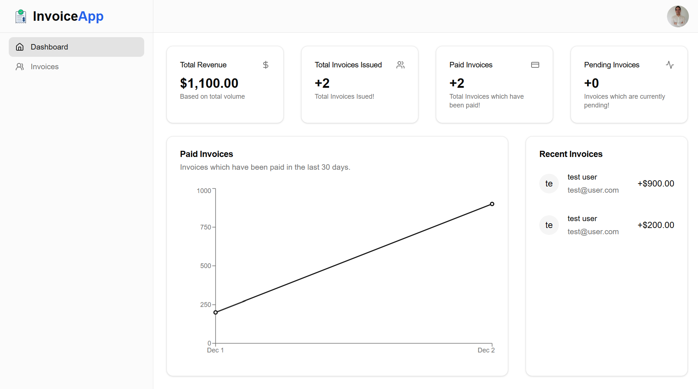

# InvoiceApp

Invoices App which includes a dashboard , emails and more.

## Tech Stack

Next.js, AuthJS, Neon PostgreSQL DB, Prisma, Resend, React Email, JS PDF, Recharts, Tailwindcss, Shadcn/UI.

## Features

🌐 Next.js App Router

🔐 AuthJS Oauth

📧 Passwordless Auth

🔑 OAuth (Google and GitHub)

📧 Email notification with Resend

📄 PDF Invoice Generate

💿 Neon PostgreSQL Database

💨 Prisma Orm

📈 Recharts for displaying Charts

✅ Server Validation using Conform

🎨 Styling with Tailwindcss and Shadcn UI

😶‍🌫️ Deployment to vercel

- React Streaming

- Server side implementation

- Performance Optimized

## Live Demo

https://invoice-app-jade-rho.vercel.app

## Usage/Examples

